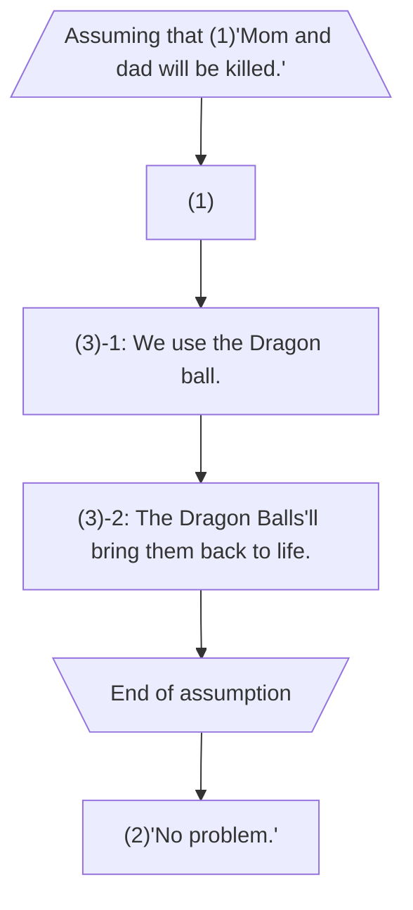

```mermaid
graph TD
  A[/"Assuming that (1)'Mom and dad will be killed.'"\];
  B["(1)"];
  A-->B;
  C["(3)-1: We use the Dragon ball."];
  D["(3)-2: The Dragon Balls'll bring them back to life."];
  B-->C-->D;
  E[\"End of assumption"/];
  D-->E;
  F["(2)'No problem.'"];
  E-->F;
```
