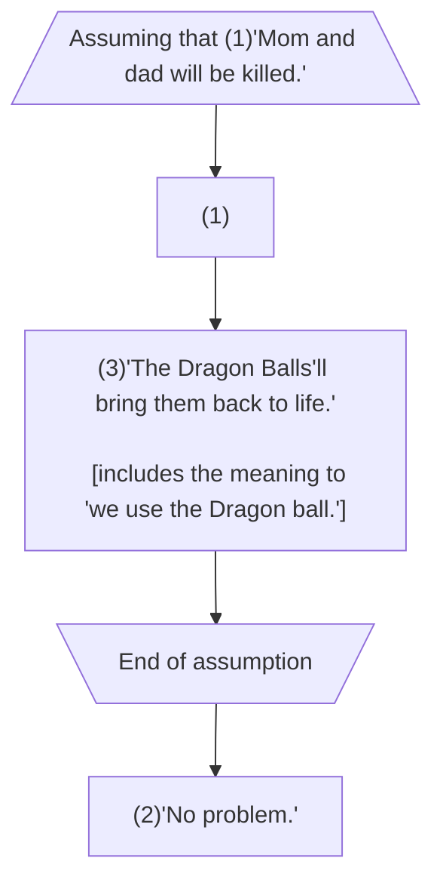

```mermaid
graph TD
  A[/"Assuming that (1)'Mom and dad will be killed.'"\];
  B["(1)"];
  A-->B;
  C["(3)'The Dragon Balls'll bring them back to life.'<br>
  [includes the meaning to 'we use the Dragon ball.']"];
  B-->C;
  D[\"End of assumption"/];
  C-->D;
  E["(2)'No problem.'"];
  D-->E;
```
